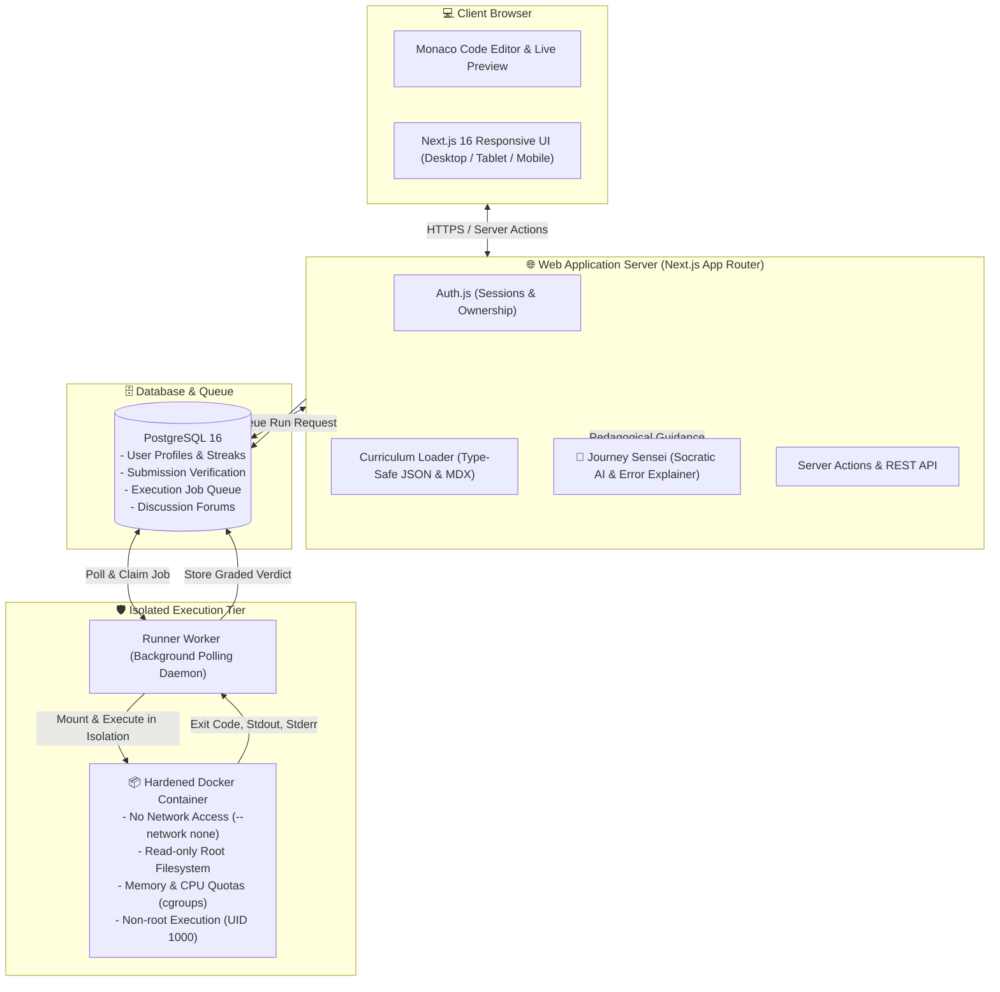

# Code Journey

<div align="center">

# 🚀 Code Journey

**Learn to code. Free, forever.**

A modern, next-generation coding education platform combining structured curriculum, interactive challenges executed in an isolated sandbox, verified progress tracking, vibrant community discussions, 100% Vietnamese/English bilingual parity, and an AI mentor that teaches instead of solving.

🌐 **Live Platform**: [https://codejourney.shop](https://codejourney.shop/)

[**English**](README.md) • [**Tiếng Việt**](README.vi.md)

<br/>

[](https://codejourney.shop/)
[](https://github.com/TysonTranThai/code-journey/releases)
[](https://nextjs.org/)
[](https://react.dev/)
[](https://www.typescriptlang.org/)
[](https://tailwindcss.com/)
[](https://www.postgresql.org/)
[](https://orm.drizzle.team/)
[](https://vitest.dev/)
[](docs/A11Y.md)
[](README.vi.md)
[](LICENSE)

</div>

---

## 🌟 Key Highlights

- **🎓 7 Comprehensive Tracks & 2,900+ Pages**:
  - **Web Development**: HTML5, CSS3, Modern JavaScript (ES2024+), DOM manipulation, async patterns, and component architecture.
  - **Python**: Core syntax, idiomatic collections, algorithmic problem solving, functional paradigms, and OOP.
  - **C**: Manual memory management, pointers, memory layouts, low-level data structures, and file I/O.
  - **C++**: Modern C++20, STL algorithms, templates, RAII, move semantics, and systems programming.
  - **C#**: .NET 9 CLI, type safety, LINQ, records, pattern matching, and async/await task pipelines.
  - **Java**: JVM internals, OOP hierarchies, Java Collections Framework, lambda streams, and exception handling.
  - **Học Sinh Giỏi (HSG) Competitive Programming**: Specialized track tailored for Vietnamese high-school olympiads — time/space complexity analysis, frequency arrays, greedy strategies, two-pointers, prefix/difference arrays, recursion, backtracking, BFS/DFS, and dynamic programming.
- **🤖 Journey Sensei — Socratic AI Mentor**:
  - An intelligent mentor designed to teach how to think like a software engineer.
  - Never spoils answers or outputs ready-to-paste code solutions.
  - **Bilingual Pedagogical Error Explainer**: Detects runtime crashes and compilation failures (e.g. GCC/Clang, Python, .NET, OpenJDK errors), explaining the root cause in plain English or Vietnamese with guided troubleshooting prompts.
- **⚡ Dual-Engine Execution Architecture**:
  - **Live Browser Runner**: Zero-latency interactive DOM execution for HTML/CSS/JavaScript with instant live feedback as you type.
  - **Isolated Container Sandbox**: Multi-tenant, resource-capped container sandbox executing untrusted student code (Python, C, C++, C#, Java) with dropped Linux privileges, read-only roots, and strict network isolation.
- **🇻🇳 100% English & Vietnamese Bilingual Parity**:
  - Every track, lesson, challenge statement, test hint, discussion forum, and system message is available natively in both English and Vietnamese.
- **🛡️ Enterprise-Grade Security & Integrity**:
  - Arbitrary student code NEVER executes on the web tier or host system.
  - Authenticated submissions with cryptographic ownership verification and rate limiting on runs, auth, and AI mentor endpoints.
- **♿ WCAG 2.1 AA Compliant Accessibility**:
  - Full keyboard navigability, high-contrast dark/light design system, screen-reader optimizations, and an intentionally designed mobile coding workspace.

---

## 🏛️ System Architecture

Code Journey uses a clean, resilient **modular monolith** design. The Next.js web application manages UI, API routes, and curriculum serving, while untrusted code execution is strictly isolated in an asynchronous worker tier.



---

## 🚀 Quick Start

### Prerequisites

| Tool               | Recommended Version | Notes                                                       |
| :----------------- | :------------------ | :---------------------------------------------------------- |
| **Node.js**        | `≥ 22.0.0`          | Developed on Node 22 LTS                                    |
| **pnpm**           | `≥ 10.0.0`          | Package manager (`corepack enable` or `npm i -g pnpm`)      |
| **Docker Desktop** | Latest              | Required for PostgreSQL and local sandbox challenge grading |
| **Git**            | `≥ 2.40.0`          | Version control                                             |

### Installation

```bash
# 1. Clone the repository
git clone https://github.com/TysonTranThai/code-journey.git
cd code-journey

# 2. Install dependencies
pnpm install

# 3. Configure environment
cp .env.example .env.local

# 4. Start local PostgreSQL container
pnpm db:up

# 5. Run database migrations & insert seed data
pnpm db:migrate
pnpm db:seed

# 6. Start development server
pnpm dev
```

Open [**http://localhost:3000**](http://localhost:3000) in your browser.

- **Health Check**: [http://localhost:3000/health](http://localhost:3000/health) (verifies Next.js and PostgreSQL connectivity).
- **Default Seed Accounts**:
  - Student: `dev-student@codejourney.local` / `dev-password-123`
  - Admin: `dev-admin@codejourney.local` / `dev-password-123`

---

## 🏃 Running the Challenge Execution Loop Locally

Frontend challenges (HTML/CSS/JS) execute directly in your browser with zero extra setup.

To test multi-language backend challenges (Python, C, C++, C#, Java) in the secure sandbox:

```bash
# Terminal 1: Build the hardened sandbox container (one-time)
pnpm sandbox:build

# Terminal 2: Run the challenge worker
pnpm worker

# Terminal 3: Run the web application
pnpm dev
```

When you click **Run** or **Submit Code**, the worker claims the job, runs the verification suite inside the isolated container, and returns the verdict in real time!

---

## 💻 Available Commands

| Command              | Description                                                                       |
| :------------------- | :-------------------------------------------------------------------------------- |
| `pnpm dev`           | Starts the Next.js development server on port 3000                                |
| `pnpm build`         | Compiles the production build (runs strict typechecking + static page generation) |
| `pnpm start`         | Serves the production build                                                       |
| `pnpm test`          | Runs 178+ Vitest unit and integration test suites                                 |
| `pnpm test:watch`    | Runs Vitest in interactive watch mode                                             |
| `pnpm test:e2e`      | Runs Playwright end-to-end and automated WCAG accessibility audits                |
| `pnpm typecheck`     | Strict TypeScript compilation check (`tsc --noEmit`)                              |
| `pnpm lint`          | Runs ESLint 9 flat config across all application files                            |
| `pnpm lint:fix`      | Runs ESLint with automated fixes                                                  |
| `pnpm format`        | Formats all code, JSON, and MDX files with Prettier                               |
| `pnpm format:check`  | Checks code formatting without writing changes                                    |
| `pnpm worker`        | Starts the background execution worker for sandboxed code grading                 |
| `pnpm sandbox:build` | Builds the secure Docker sandbox runner image                                     |
| `pnpm db:up`         | Starts the local PostgreSQL 16 container via Docker Compose (port 5433)           |
| `pnpm db:down`       | Stops the local PostgreSQL container                                              |
| `pnpm db:migrate`    | Applies pending Drizzle database migrations                                       |
| `pnpm db:generate`   | Generates new Drizzle schema migrations                                           |
| `pnpm db:seed`       | Seeds development users, tracks, and achievements                                 |
| `pnpm db:studio`     | Launches Drizzle Studio GUI for inspecting database tables                        |

---

## 📂 Project Structure

```
code-journey/
├── docs/                   # Engineering design, threat models, WCAG audits & production guides
│   ├── ARCHITECTURE.md     # In-depth architectural decomposition & data flow
│   ├── DATA-MODEL.md       # Relational entity diagrams & Drizzle ORM schema
│   ├── SECURITY.md         # Threat mitigations, sandboxing rules & rate limiting
│   ├── A11Y.md             # WCAG 2.1 AA accessibility conformance report
│   └── PRODUCTION.md       # VPS deployment, Docker hardening & worker topology
├── src/
│   ├── app/                # Next.js App Router (pages, API handlers, layout, sitemaps)
│   ├── components/         # Modular React 19 UI components (editor, navbar, mentor, forums)
│   ├── content/            # Version-controlled curriculum data (JSON schemas + MDX lessons)
│   │   └── tracks/         # web-development, python, c, cpp, csharp, java, hsg
│   ├── lib/                # Shared utilities, curriculum loaders, Drizzle DB client, i18n
│   ├── server/             # Auth.js setup, RBAC guards, server actions
│   └── workers/            # Independent execution worker & Docker sandbox controller
├── tests/
│   ├── unit/               # Vitest unit suites (loaders, guardrails, schema validation)
│   ├── integration/        # Database integration, rate-limit, and isolation tests
│   └── e2e/                # Playwright cross-browser & accessibility test suites
├── docker/                 # Production Dockerfile & sandbox definition
└── .planning/              # GSD roadmap, specification specs, and requirements
```

---

## 🔒 Security Posture

1. **Sandboxed Student Code**: Code submissions never execute in Node.js processes or on the host server. Execution occurs strictly inside short-lived, single-use container sandboxes with network disabled, read-only root directories, capped execution time (2.5s timeout), and minimal memory limits.
2. **Grade Integrity**: Submission results cannot be forged by clients; only the server-side worker writes pass/fail verdicts and grants achievement tokens to the database.
3. **Defense in Depth**: Zero secrets in source control. Strict Zod schema validation across all API endpoints, parameterized SQL queries via Drizzle ORM, and automated rate limiting on sensitive routes.

---

## 🤝 Contributing

Contributions from the developer and educator community are welcome!
Whether you want to add new curriculum lessons, improve translations, optimize the sandbox runner, or enhance UI components:

1. Fork the repository
2. Create your feature branch (`git checkout -b feature/amazing-feature`)
3. Ensure all tests and checks pass:
   ```bash
   pnpm lint
   pnpm typecheck
   pnpm test
   ```
4. Commit your changes with conventional commit syntax (`git commit -m "feat: add binary search challenges"`)
5. Push to the branch (`git push origin feature/amazing-feature`)
6. Open a Pull Request

Please read [CONTRIBUTING.md](CONTRIBUTING.md) for more details.

---

## 📜 License

This project is open source and available under the [MIT License](LICENSE).

---

<div align="center">
  <sub>Built with ❤️ for learners around the world. Code Journey is free, and will stay free forever.</sub>
</div>
