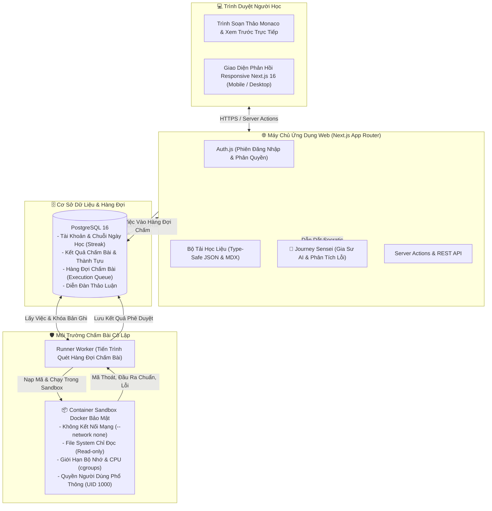

# Code Journey

<div align="center">

# 🚀 Code Journey

**Học lập trình thực chiến. Hoàn toàn miễn phí, mãi mãi.**

Nền tảng giáo dục lập trình thế hệ mới kết hợp giữa lộ trình bài bản, thử thách tương tác chấm điểm tự động trong môi trường sandbox cô lập, theo dõi tiến độ chuẩn xác, diễn đàn trao đổi sôi nổi, hỗ trợ song ngữ Anh – Việt 100% cùng gia sư AI theo phương pháp Socratic định hướng tư duy.

🌐 **Trang Web Trực Tuyến**: [https://codejourney.shop](https://codejourney.shop/)

[**English**](README.md) • [**Tiếng Việt**](README.vi.md)

<br/>

[](https://codejourney.shop/)
[](https://github.com/TysonTranThai/code-journey/releases)
[](https://nextjs.org/)
[](https://react.dev/)
[](https://www.typescriptlang.org/)
[](https://tailwindcss.com/)
[](https://www.postgresql.org/)
[](https://orm.drizzle.team/)
[](https://vitest.dev/)
[](docs/A11Y.md)
[](README.vi.md)
[](LICENSE)

</div>

---

## 🌟 Những Điểm Nổi Bật

- **🎓 7 Lộ Trình Toàn Diện & Hơn 2.900 Trang Học Liệu**:
  - **Phát triển Web (Web Development)**: HTML5, CSS3 hiện đại, JavaScript ES2024+, thao tác DOM, lập trình bất đồng bộ (async/await), và kiến trúc module/component.
  - **Python**: Cú pháp cốt lõi, cấu trúc dữ liệu chuẩn, giải quyết thuật toán, lập trình hướng đối tượng (OOP) và lập trình hàm.
  - **C**: Quản lý bộ nhớ thủ công, con trỏ (pointers), bố cục ô nhớ, cấu trúc dữ liệu cấp thấp và xuất nhập tệp tin (File I/O).
  - **C++**: Chuẩn hiện đại C++20, thư viện khuôn mẫu STL, con trỏ thông minh, ngữ nghĩa di chuyển (move semantics) và lập trình hệ thống.
  - **C#**: Hệ sinh thái .NET 9, an toàn kiểu dữ liệu, LINQ, records, so khớp mẫu (pattern matching), và đường ống tác vụ bất đồng bộ.
  - **Java**: Cơ chế máy ảo JVM, tính kế thừa đa hình OOP, Java Collections Framework, lambda & Streams API, và cơ chế xử lý ngoại lệ.
  - **Luyện thi Học Sinh Giỏi (HSG) Tin Học**: Lộ trình đặc thù cho học sinh chuyên Tin và thi HSG cấp Tỉnh/Quốc gia — đánh giá độ phức tạp thuật toán, mảng đánh dấu, tham lam (Greedy), hai con trỏ, mảng cộng dồn & mảng hiệu, đệ quy, quay lui (Backtracking), tìm kiếm đồ thị BFS/DFS, và quy hoạch động (Dynamic Programming).
- **🤖 Journey Sensei — Gia Sư AI Socratic**:
  - Được huấn luyện theo phương pháp Socratic: **Dẫn dắt tư duy chứ không làm hộ bài tập**, không bao giờ đưa ra lời giải ăn sẵn.
  - Đặt các câu hỏi gợi mở để người học tự phát hiện lỗi sai cú pháp, lỗi lệch chỉ số (off-by-one), hoặc tư duy thuật toán chưa tối ưu.
  - **Trình giải thích lỗi song ngữ thông minh**: Tự động chặn và phân tích các lỗi biên dịch (GCC/Clang, Python, .NET, OpenJDK) hoặc lỗi runtime, dịch sang tiếng Việt trong sáng cùng các chỉ dẫn gỡ lỗi hành động cụ thể.
- **⚡ Kiến Trúc Chạy Mã Nguồn Kép Tối Tân**:
  - **Trình chạy trực tiếp trên trình duyệt (Browser Runner)**: Phản hồi tức thì không độ trễ cho HTML/CSS/JavaScript, tự động cập nhật kết quả song song khi gõ mã.
  - **Sandbox Docker cô lập tuyệt đối**: Thực thi các ngôn ngữ backend (Python, C, C++, C#, Java) trong môi trường container giới hạn tài nguyên CPU/RAM, ngắt hoàn toàn kết nối mạng (`--network none`), chạy dưới quyền non-root (UID 1000) và hệ thống tập tin chỉ đọc (Read-only).
- **🇻🇳 100% Chuẩn Song Ngữ Anh – Việt**:
  - Toàn bộ lý thuyết, đề bài thử thách, gợi ý chấm thử, giao diện bài thi, và bảng điều khiển đều được biên soạn bản ngữ tiếng Việt chuẩn mực, tôn trọng thuật ngữ công nghệ thông tin.
- **🛡️ An Toàn & Toàn Vẹn Kết Quả Học Tập**:
  - Mã nguồn của học viên **TUYỆT ĐỐI KHÔNG BAO GIỜ** chạy trực tiếp trên máy chủ web.
  - Mọi yêu cầu chấm bài đều được ký xác thực định danh, gắn hàng đợi và kiểm tra giới hạn tần suất (rate-limit).
- **♿ Chuẩn Tiếp Cận WCAG 2.1 AA & Thân Thiện Mobile**:
  - Hỗ trợ đầy đủ phím tắt bàn phím, trình đọc màn hình cho người khiếm thị, độ tương phản cao và không gian làm bài được thiết kế tỉ mỉ cho cả thiết bị di động và máy tính bảng.

---

## 🏛️ Kiến Trúc Hệ Thống

Code Journey được xây dựng theo mô hình **Modular Monolith** hiện đại: toàn bộ giao diện và API tập trung trong Next.js 16, sử dụng PostgreSQL làm nguồn chân lý dữ liệu duy nhất, và tách biệt hoàn toàn công đoạn thực thi mã nguồn sang một tiến trình Worker độc lập.



---

## 🚀 Hướng Dẫn Cài Đặt Nhanh

### Yêu cầu hệ thống

| Công cụ            | Phiên bản khuyến nghị | Ghi chú                                                    |
| :----------------- | :-------------------- | :--------------------------------------------------------- |
| **Node.js**        | `≥ 22.0.0`            | Đã kiểm thử ổn định trên Node 22 LTS                       |
| **pnpm**           | `≥ 10.0.0`            | Trình quản lý gói (`corepack enable` hoặc `npm i -g pnpm`) |
| **Docker Desktop** | Mới nhất              | Cần thiết để chạy PostgreSQL cục bộ và máy ảo chấm sandbox |
| **Git**            | `≥ 2.40.0`            | Trình quản lý mã nguồn                                     |

### Các bước khởi chạy

```bash
# 1. Sao chép kho mã nguồn về máy
git clone https://github.com/TysonTranThai/code-journey.git
cd code-journey

# 2. Cài đặt các gói phụ thuộc
pnpm install

# 3. Tạo cấu hình môi trường
cp .env.example .env.local

# 4. Khởi động PostgreSQL qua Docker Compose
pnpm db:up

# 5. Áp dụng cấu trúc bảng và nạp dữ liệu mẫu
pnpm db:migrate
pnpm db:seed

# 6. Khởi chạy máy chủ phát triển
pnpm dev
```

Mở trình duyệt và truy cập: [**http://localhost:3000**](http://localhost:3000).

- **Kiểm tra trạng thái hệ thống**: [http://localhost:3000/health](http://localhost:3000/health) (kiểm tra Next.js và kết nối PostgreSQL).
- **Tài khoản thử nghiệm mặc định**:
  - Học viên: `dev-student@codejourney.local` / `dev-password-123`
  - Quản trị viên: `dev-admin@codejourney.local` / `dev-password-123`

---

## 🏃 Thử Nghiệm Vòng Lặp Chấm Bài Cục Bộ

Đối với các bài tập Web (HTML/CSS/JS), mã nguồn sẽ được biên dịch và hiển thị tức thì ngay trên trình duyệt mà không cần cài đặt thêm.

Đối với các bài tập đa ngôn ngữ (Python, C, C++, C#, Java):

```bash
# Cửa sổ dòng lệnh 1: Build image sandbox cô lập (chỉ cần chạy lần đầu)
pnpm sandbox:build

# Cửa sổ dòng lệnh 2: Khởi chạy worker lắng nghe hàng đợi chấm
pnpm worker

# Cửa sổ dòng lệnh 3: Chạy máy chủ giao diện
pnpm dev
```

Khi bạn nhấn **Chạy thử** hoặc **Nộp bài**, worker sẽ nhận tác vụ, nạp vào container sandbox an toàn và trả về kết quả chi tiết từng ca kiểm thử trong tích tắc.

---

## 💻 Danh Sách Lệnh Quản Trị

| Câu lệnh             | Chức năng                                                            |
| :------------------- | :------------------------------------------------------------------- |
| `pnpm dev`           | Khởi động máy chủ Next.js dev tại cổng 3000                          |
| `pnpm build`         | Đóng gói sản phẩm (kiểm tra TypeScript và sinh trang tĩnh)           |
| `pnpm start`         | Chạy bản build sản phẩm                                              |
| `pnpm test`          | Chạy toàn bộ 178+ bài kiểm thử tự động với Vitest                    |
| `pnpm test:watch`    | Chạy Vitest ở chế độ theo dõi thay đổi tập tin                       |
| `pnpm test:e2e`      | Chạy Playwright E2E và kiểm tra chuẩn tiếp cận người khuyết tật WCAG |
| `pnpm typecheck`     | Kiểm tra nghiêm ngặt kiểu dữ liệu TypeScript (`tsc --noEmit`)        |
| `pnpm lint`          | Quét quy chuẩn mã nguồn với ESLint 9 (flat config)                   |
| `pnpm lint:fix`      | Tự động sửa các lỗi format/linting có thể sửa                        |
| `pnpm format`        | Định dạng toàn bộ tập tin bằng Prettier                              |
| `pnpm format:check`  | Kiểm tra định dạng mà không ghi đè tập tin                           |
| `pnpm worker`        | Khởi chạy worker chấm bài chạy nền                                   |
| `pnpm sandbox:build` | Build Docker image dành cho sandbox chấm bài                         |
| `pnpm db:up`         | Bật container PostgreSQL 16 (cổng 5433) qua Docker Compose           |
| `pnpm db:down`       | Dừng container PostgreSQL (dữ liệu vẫn được lưu)                     |
| `pnpm db:migrate`    | Chạy migration cấu trúc cơ sở dữ liệu với Drizzle                    |
| `pnpm db:generate`   | Tạo file migration mới khi có thay đổi trong schema                  |
| `pnpm db:seed`       | Nạp dữ liệu mẫu ban đầu (tài khoản, chứng chỉ, lộ trình)             |
| `pnpm db:studio`     | Mở giao diện Drizzle Studio trực quan quản lý dữ liệu                |

---

## 📂 Bố Cục Dự Án

```
code-journey/
├── docs/                   # Tài liệu kiến trúc, mô hình đe dọa bảo mật, báo cáo A11y & hướng dẫn triển khai
│   ├── ARCHITECTURE.md     # Phân rã kiến trúc chi tiết và luồng dữ liệu
│   ├── DATA-MODEL.md       # Lược đồ quan hệ thực thể và Drizzle ORM schema
│   ├── SECURITY.md         # Giải pháp phòng thủ mối đe dọa, cấu hình sandbox và giới hạn tần suất
│   ├── A11Y.md             # Báo cáo đối chiếu chuẩn tiếp cận WCAG 2.1 AA
│   └── PRODUCTION.md       # Triển khai thực tế trên VPS, bảo mật Docker và topology worker
├── src/
│   ├── app/                # App Router của Next.js (các trang giao diện, API routes, layout)
│   ├── components/         # Thành phần UI React 19 (trình soạn thảo code, navbar, Sensei, diễn đàn)
│   ├── content/            # Kho học liệu được phiên bản hóa (JSON schemas + bài giảng MDX)
│   │   └── tracks/         # web-development, python, c, cpp, csharp, java, hsg
│   ├── lib/                # Thư viện dùng chung, bộ đọc học liệu, kết nối Drizzle DB, i18n
│   ├── server/             # Cấu hình Auth.js, phân quyền bảo vệ, server actions
│   └── workers/            # Tiến trình worker chấm bài & điều khiển Docker sandbox
├── tests/
│   ├── unit/               # Bộ kiểm thử đơn vị Vitest (loaders, guardrails, schema)
│   ├── integration/        # Kiểm thử tích hợp cơ sở dữ liệu, hàng đợi và cách ly sandbox
│   └── e2e/                # Kiểm thử đầu-cuối Playwright và kiểm thử chuẩn tiếp cận
├── docker/                 # File cấu hình Dockerfile production và môi trường sandbox
└── .planning/              # Kế hoạch phát triển, đặc tả yêu cầu và lộ trình GSD
```

---

## 🔒 Cam Kết Bảo Mật

1. **Cô Lập Mã Nguồn Thực Thi**: Mã nguồn do học viên nhập vào không bao giờ có thể can thiệp vào máy chủ ứng dụng hoặc máy chủ chính. Mọi tiến trình chạy đều nằm trong container đóng gói, vô hiệu hóa mạng, hệ thống tập tin chỉ đọc, giới hạn thời gian (2.5 giây) và định mức RAM tối thiểu.
2. **Bảo Vệ Tính Toàn Vẹn Điểm Số**: Phía máy khách (frontend) không thể tự xác nhận vượt qua thử thách; chỉ có worker máy chủ sau khi chấm bài thực tế mới có thẩm quyền lưu điểm và cấp huy hiệu vào cơ sở dữ liệu.
3. **Phòng Thủ Chiều Sâu**: Không lưu bất kỳ mật khẩu hoặc khóa bảo mật nào trong mã nguồn. Toàn bộ đầu vào API đều được thẩm định nghiêm ngặt bằng Zod, truy vấn cơ sở dữ liệu an toàn với tham số hóa của Drizzle ORM, và giới hạn tần suất gửi yêu cầu tự động.

---

## 🤝 Tham Gia Đóng Góp

Chúng tôi luôn chào đón mọi sự đóng góp từ cộng đồng lập trình viên và giáo viên!
Dù là bổ sung thêm bài tập, chuẩn hóa nội dung bản dịch, tối ưu tốc độ sandbox hay hoàn thiện giao diện:

1. Fork kho mã nguồn này về tài khoản GitHub của bạn
2. Tạo nhánh tính năng mới (`git checkout -b feature/tinh-nang-moi`)
3. Đảm bảo toàn bộ kiểm thử và quy chuẩn đều đạt yêu cầu:
   ```bash
   pnpm lint
   pnpm typecheck
   pnpm test
   ```
4. Commit thay đổi theo chuẩn Conventional Commits (`git commit -m "feat: bổ sung bài tập quy hoạch động"`)
5. Đẩy nhánh lên GitHub (`git push origin feature/tinh-nang-moi`)
6. Mở một Pull Request mới

Chi tiết vui lòng xem tại [CONTRIBUTING.md](CONTRIBUTING.md).

---

## 📜 Giấy Phép Mã Nguồn

Dự án này là mã nguồn mở và được phát hành theo các điều khoản của [Giấy phép MIT](LICENSE).

---

<div align="center">
  <sub>Được phát triển với tình yêu thương dành cho người học công nghệ trên khắp thế giới. Code Journey hoàn toàn miễn phí và sẽ luôn luôn như vậy.</sub>
</div>
